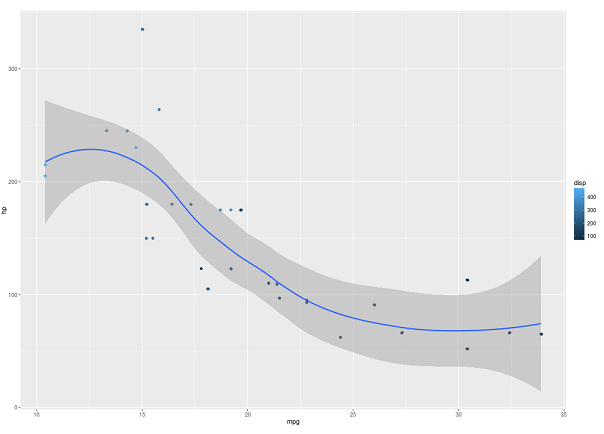
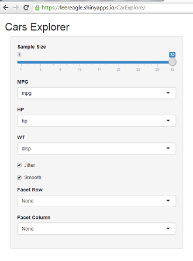

## Introduction

'mtcars' is one of the default dataset for practicing and demostration of R programming language. The data was extracted from the 1974 Motor Trend US magazine, and comprises fuel consumption and 10 aspectsof automobile design and performance for 32 automobiles (1973-74 models).

To learn more about 'mtcars' dataset, type 'help(mtcars)' or '??mtcars' in your R console.

---&radio

## Question 1

How many names(columns) are there in dataset mtcars in total?

1. 9
2. 10
3. _11_
4. 12

*** .hint
Use names(mtcars) to find out.

*** .explanation
There are 11 names: "mpg"  "cyl"  "disp" "hp"   "drat" "wt"   "qsec" "vs"   "am"   "gear" "carb"

---

## Shiny App - Explore Cars (mtcars)

---
## How to use

Choose MPG and HP then you will see the information. Choose color to differentiate the dimension with different colors. You can also tick 'Jitter' and 'Smooth' to see their effect. If you wish to compare the data in different facets. 'facet row' and 'facet column' are also available to choose.

https://leereagle.shinyapps.io/CarExplore/
